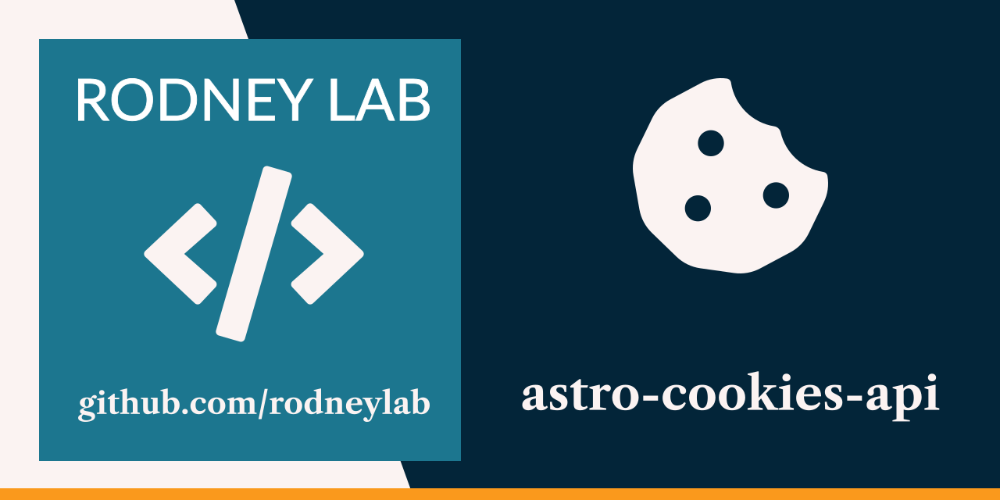

<p align="center">
  <a aria-label="Open Rodney Lab site" href="https://rodneylab.com" rel="nofollow noopener noreferrer">
    
  </a>
</p>
<h1 align="center">
  Astro Cookies API
</h1>

# astro-cookies-api

[](https://stackblitz.com/github/rodneylab/astro/tree/main/demos/astro-cookies-api)

Astro demo with Mux video player showing how you can store playback position using the Astro Cookies API. This might be useful to let the visitor resume their content where they left offf when logging in on a different device. This code from Rodney Lab accompanies the <a aria-label="article on Astro Cookies API: open the Rodney Lab tutorial" href="https://rodneylab.com/astro-cookies-api/">article on Astro Cookies API</a>. If you have any questions, please drop a comment at the bottom of that page.

# Astro Cookies API

```
pnpm create astro -- --template rodneylab/astro/tree/main/demos/astro-cookies-api
```

## 🧞 Commands

All commands are run from the root of the project, from a terminal:

| Command                        | Action                                       |
| :----------------------------- | :------------------------------------------- |
| `pnpm install`                 | Installs dependencies                        |
| `pnpm astro telemetry disable` | Disable data collection                      |
| `pnpm dev`                     | Starts local dev server at `localhost:4321`  |
| `pnpm build`                   | Build your production site to `./dist/`      |
| `pnpm preview`                 | Preview your build locally, before deploying |

Feel free to jump into the [Rodney Lab matrix chat room](https://matrix.to/#/%23rodney:matrix.org).
