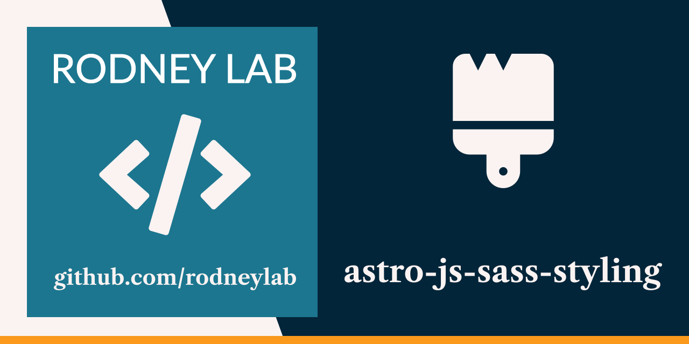

<p align="center">
  <a aria-label="Open Rodney Lab site" href="https://rodneylab.com" rel="nofollow noopener noreferrer">
    
  </a>
</p>
<h1 align="center">
  Astro JS Sass Styling
</h1>

# astro-js-sass

[](https://stackblitz.com/github/rodneylab/astro/tree/main/demos/astro-js-sass)

Code from Rodney Lab <a aria-label="Open Rodney Lab blog post on Astro JS Sass Styling" href="https://rodneylab.com/astro-js-sass-styling/">Astro JS Sass Styling tutorial</a>. If you have any questions, please drop a comment at the bottom of that page.

# Astro JS Sass

```
pnpm init astro -- --template https://github.com/rodneylab/astro/tree/main/demos/astro-js-sass-styling
```

## 🧞 Commands

All commands are run from the root of the project, from a terminal:

| Command                        | Action                                       |
| :----------------------------- | :------------------------------------------- |
| `pnpm install`                 | Installs dependencies                        |
| `pnpm astro telemetry disable` | Disable data collection                      |
| `pnpm run dev`                 | Starts local dev server at `localhost:3000`  |
| `pnpm run build`               | Build your production site to `./dist/`      |
| `pnpm run preview`             | Preview your build locally, before deploying |

Feel free to jump into the [Rodney Lab matrix chat room](https://matrix.to/#/%23rodney:matrix.org).
