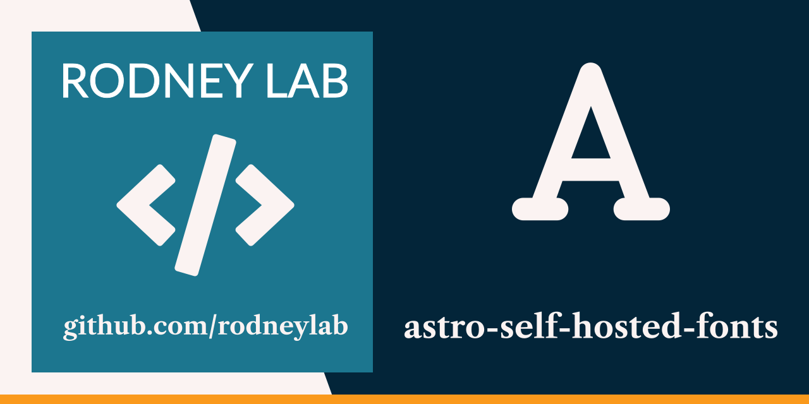

<p align="center">
  <a aria-label="Open Rodney Lab site" href="https://rodneylab.com" rel="nofollow noopener noreferrer">
    
  </a>
</p>
<h1 align="center">
  Astro Self-Hosted Fonts
</h1>

# astro-self-hosted-fonts

[](https://stackblitz.com/github/rodneylab/astro/tree/main/demos/astro-self-hosted-fonts)

Final code from Rodney Lab <a aria-label="Open Rodney Lab blog post on Astro Self-Hosted Fonst" href="https://rodneylab.com/astro-self-hosted-fonts/">video on Astro self-hosted fonts and font optimisation</a>.

# Astro Self-Hosted Fonts

```
pnpm init astro -- --template https://github.com/rodneylab/astro/tree/main/demos/astro-self-hosted-fonts
```

## 🧞 Commands

All commands are run from the root of the project, from a terminal:

| Command            | Action                                       |
| :----------------- | :------------------------------------------- |
| `pnpm install`     | Installs dependencies                        |
| `pnpm run dev`     | Starts local dev server at `localhost:3000`  |
| `pnpm run build`   | Build your production site to `./dist/`      |
| `pnpm run preview` | Preview your build locally, before deploying |
