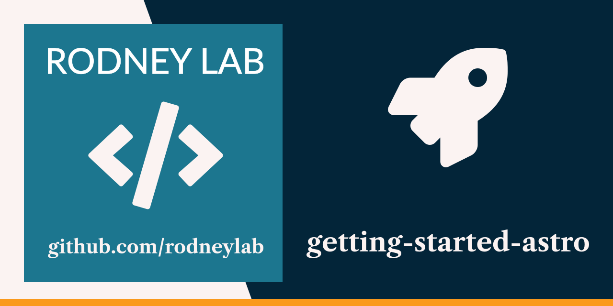

<p align="center">
  <a aria-label="Open Rodney Lab site" href="https://rodneylab.com" rel="nofollow noopener noreferrer">
    
  </a>
</p>
<h1 align="center">
  Getting Started with Astro
</h1>

# getting-started-astro

[](https://stackblitz.com/github/rodneylab/astro/tree/main/demos/getting-started-astro)

[](https://open.vscode.dev/rodneylab/astro/tree/main/demos/getting-started-astro)

Playground code handy if you are just getting going in Astro and want to try our React, Svelte and Markdown components while playing with partial hydration. The code accompanies the <a aria-label="Open Rodney Lab blog post on getting started with Astro" href="https://rodneylab.com/getting-started-astro/">post on getting started with Astro</a>. If you have any questions, please drop a comment at the bottom of that page.

# Getting Started with Astro Playground

```
pnpm init astro -- --template https://github.com/rodneylab/astro/tree/main/demos/getting-started-astro
```

## 🧞 Commands

All commands are run from the root of the project, from a terminal:

| Command            | Action                                       |
| :----------------- | :------------------------------------------- |
| `pnpm install`     | Installs dependencies                        |
| `pnpm run dev`     | Starts local dev server at `localhost:3000`  |
| `pnpm run build`   | Build your production site to `./dist/`      |
| `pnpm run preview` | Preview your build locally, before deploying |
